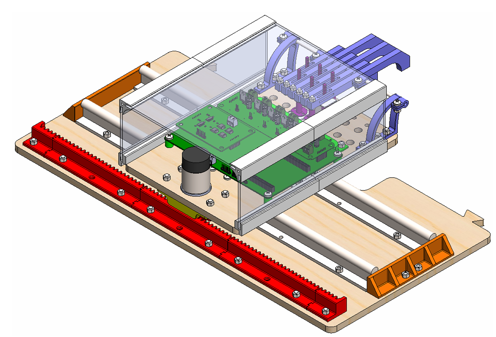

# Piano-Player-PCBs
Motherboard and Motor Driver Board for the ELEC 391 Robot Piano Player Project. Boards designed by David Tang for Group 9.

## Group 9 Piano Robot Player

  

  

## Motherboard 

## Motor Driver Board

